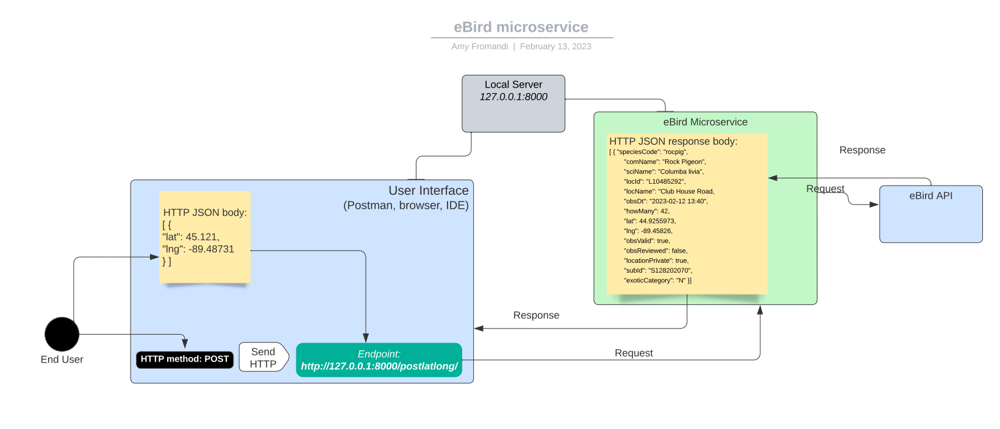
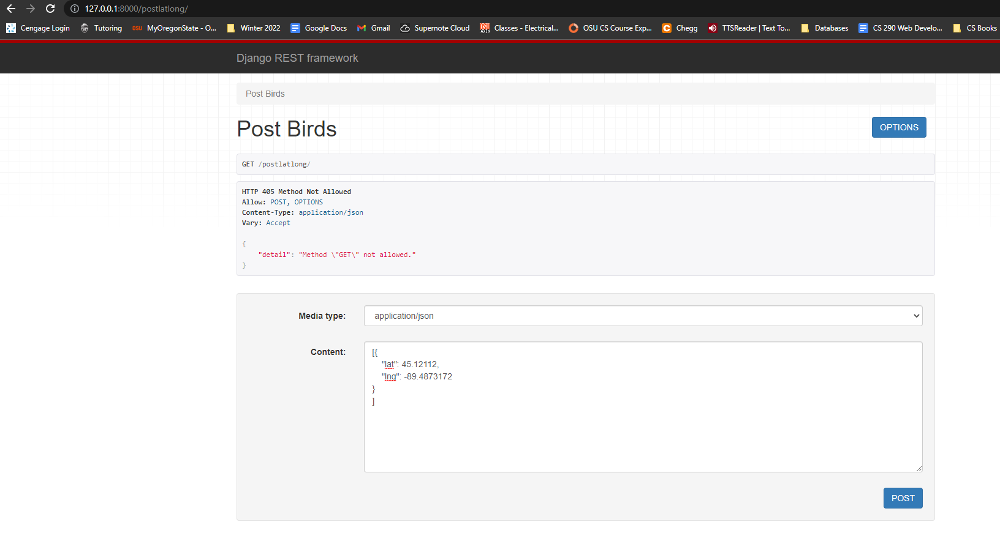
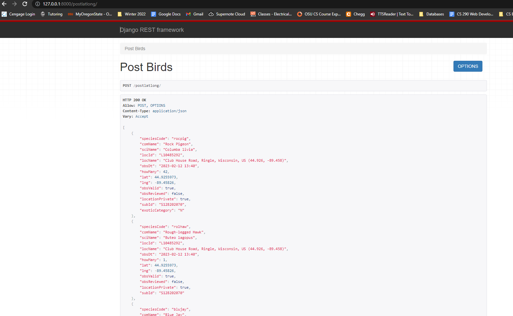

# eBird Microservice

The eBird microservice receives a latitude and longitude and returns a JSON array of
all birds recorded in the area from the past 30 days.


## Workflow


## Installation

Go to root microserviceProject directory. Run each command below.

```bash
pip install django
pip install djangorestframework
pip install requests
pip install django-filter
```

## Usage
To run the service, in the root directory of the microserviceProject, type in the command below.
```bash
python manage.py runserver
```
**Request**:
In your Python code, you can call the microservice where latitude and longitude are 
specified accordingly and the url is the local server domain where you would like to 
run the service. Below is at the local domain and port # that Django defaults to.
*Note that the location JSON keys will always be "lat" and "lng".

**Response**:
The microservice will return a JSON of all the birds in this location from the 
last 30 days.
```python
import requests

def call_microservice():
    endpoint= "http://127.0.0.1:8000/postlatlong/"
    latitude = 45.121
    longitude = -89.4873172
    location = [{"lat": latitude, "lng": longitude}]
    jsonresponse = requests.post(endpoint, json = location)
    myjson = jsonresponse.json()
    return myjson

if __name__ == '__main__':
    response = call_microservice()
    print(response)
```

Or you can use the Django Rest Framework UI. Go to your local browser and navigate to
the microservice endpoint: 
http://127.0.0.1:8000/postlatlong/

**Request**:
Post your latitude and longitude JSON in the Content text field and select POST.



**Response**:
The microservice will return a JSON of all the birds in this location from the 
last 30 days.


## Contributing

There is no limitation to the amount of requests one can make. If any modifications need to be made, please reach out to
pritta@oregonstate.edu

## License

[MIT](https://choosealicense.com/licenses/mit/)